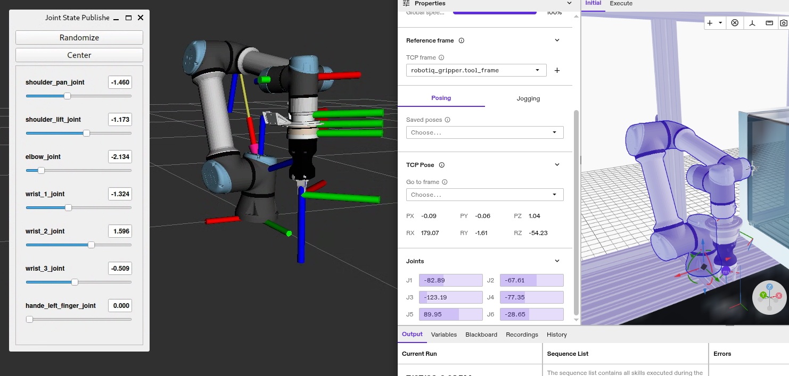

# robot_hardware_description

This package contains the robot hardware description for `flowstate_moveit` in ROS 2.

> [!NOTE]
> This package is under active development.

# Visualize robot description

```bash
# Install dependencies via rosdep, then build the package
colcon build --packages-up-to robot_hardware_description

# Run the basic display demo
source install/setup.bash
ros2 launch robot_hardware_description display.launch.py
```


